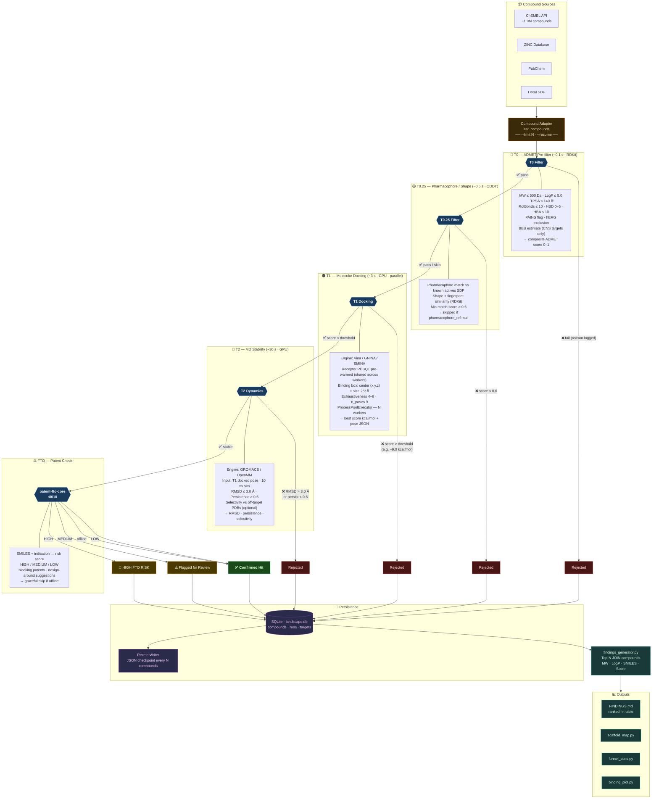
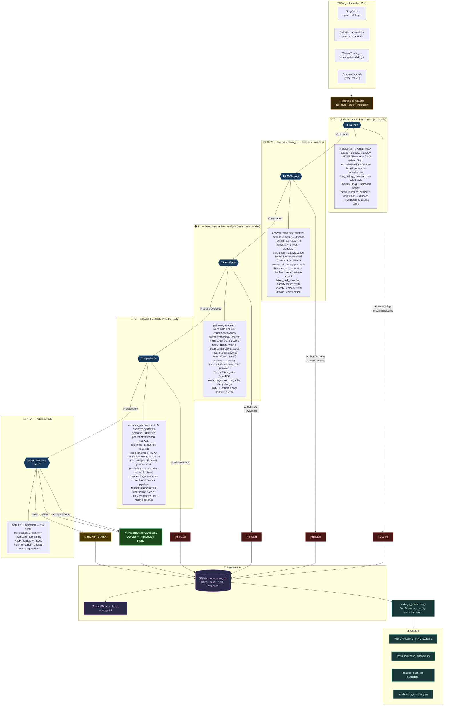
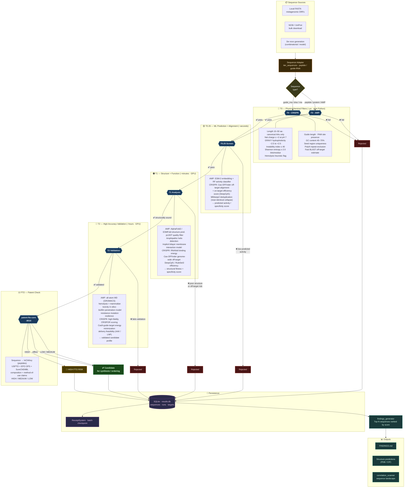

# Pipeline Model Reference — Seth's Computational Science Stack

> **Purpose:** Chemical process model reference for every pipeline tier and component,
> the ideal/optimal design for each pipeline, and an honest delta map of where the
> current implementation diverges and why.
>
> **Covers:** biochem · clinical-repurposing · genomics · (and design notes for materials)
> **Last updated:** March 2026

---

## Visual Reference — Pipeline Diagrams

Quick reference Mermaid diagrams for each pipeline. For the full optimal model, delta analysis, and build priority, see Parts I–VII below.

### Biochem — Computational Drug Discovery

_Small molecule library → ADMET filters → pharmacophore → molecular docking → MD stability → FTO._



| Tier | Stage | Runtime | Tool | Key Threshold |
|---|---|---|---|---|
| T0 | ADMET / Lipinski | ~0.1 s | RDKit | MW ≤ 500, LogP ≤ 5 |
| T0.25 | Pharmacophore / Shape | ~0.5 s | ODDT | match ≥ 0.6 |
| T1 | Molecular Docking | ~3 s · GPU | Vina / GNINA | score ≤ −9.0 kcal/mol |
| T2 | MD Stability | ~30 s · GPU | GROMACS / OpenMM | RMSD ≤ 3.0 Å, persist ≥ 0.6 |
| FTO | Patent Check | async · HTTP | patent-fto-core | LOW / MEDIUM / HIGH |

---

### Clinical — Drug Repurposing

_Approved/investigational drug × indication pairs → mechanism overlap → network biology → deep mechanistic evidence → dossier synthesis._



| Tier | Stage | Runtime | Key Modules | Key Signal |
|---|---|---|---|---|
| T0 | Mechanism + Safety | seconds | mechanism_overlap · safety_filter · trial_history | MOA overlap + no contraindication |
| T0.25 | Network + Literature | minutes | network_proximity · lincs_scorer · pubmed_cooccurrence | proximity ↑ + transcriptomic reversal |
| T1 | Deep Mechanistic | minutes · parallel | pathway_analyzer · faers_miner · evidence_scorer | RCT + cohort evidence weight |
| T2 | Dossier Synthesis | hours · LLM | evidence_synthesizer · trial_designer · dossier_generator | actionable Phase II protocol |
| FTO | Patent Check | async · HTTP | patent-fto-core | method-of-use patent risk |

---

### Genomics — Sequence Space Screening

_Peptide / guide-RNA candidates → physicochemical filters → ML prediction → structure prediction → high-accuracy validation._



| Tier | Stage | Runtime | AMP Path | CRISPR / gRNA Path |
|---|---|---|---|---|
| T0 | Physicochemical | ~µs | length · charge · GRAVY · instability · entropy · hemolysis | length · PAM · GC% · polyN · BLAST off-target |
| T0.25 | ML + Alignment | seconds | ESM-2/RF classifier · MMseqs2 dedup | Cas-OFFinder alignment · DeepCpf1 efficiency |
| T1 | Structure + Function | minutes · GPU | AlphaFold2 · amphipathicity · membrane MD | RNAfold · DeepCpf1 · genome-wide off-target |
| T2 | Full Validation | hours · GPU | all-atom MD · hemolysis in silico · resistance | CRISPOR · Cas9 energy · delivery feasibility |
| FTO | Patent Check | async · HTTP | sequence composition claim search | guide + target claim search |

---

### Patent FTO — Freedom-to-Operate Analysis

_Compound SMILES + indication → multi-database patent search → claim extraction + structure matching → LLM analysis → risk verdict + report._

```mermaid
flowchart TD
    subgraph INPUT["📥 Input  POST /fto/compound"]
        IN["smiles: str\nindication: str\njurisdictions: list\nclaim_types: [composition_of_matter,\n  method_of_use]\nuse_cache: bool"]
    end

    IN --> CACHE{"Cache\nhit?"}
    CACHE -->|"✅ yes"| CACHED["Return cached FTOResult\n(SQLite lookup by InChIKey)"]
    CACHE -->|"❌ no"| RESOLVE

    subgraph CORE["⚙️ Processing Pipeline"]
        RESOLVE["compound_resolver.py\nSMILES → canonical SMILES\n→ InChI → InChIKey\n→ molecular formula + MW\n(RDKit · no network)"]

        RESOLVE --> SEARCH

        SEARCH["patent_search adapters\n── parallel fetch ──\nUSPTO full-text + claims API\nEPO OPS (European Patent Office)\nSureChEMBL chemical entity index\nPubChem patent cross-ref\n→ patent list + raw claim text"]

        SEARCH --> EXTRACT

        EXTRACT["claim_extractor.py\nParse claim grammar:\n  comprising / consisting of\n  Markush structures (R-groups)\n  composition_of_matter\n  method_of_use\nOutputs structured Claim objects\n(regex · no LLM · fast)"]

        EXTRACT --> MATCH

        MATCH["structure_matcher.py\nTanimoto fingerprint similarity\nSubstructure match (RDKit)\nMarkush expansion + match\nPer-claim MatchResult:\n  overlap_score 0–1\n  overlap_reasoning\n  claim_type"]

        MATCH --> LLM

        LLM["llm_analyzer.py\nLLM (GPT-4o / Claude)\nevaluates borderline matches\n(Tanimoto 0.5–0.85)\nAssesses:\n  literal infringement\n  doctrine of equivalents\n  claim scope interpretation\n→ infringes [true/false/null]\n  confidence · design-around"]

        LLM --> TERM

        TERM["patent_term_calculator.py\nExpiry per jurisdiction:\n  US: filing + 20 yr + PTA\n  EP: grant + 20 yr + SPC\nExpired → clear territory\n(non-blocking)"]

        TERM --> SCORE

        SCORE["risk_scorer.py\nHIGH: composition/Markush\n  infringes=True · confidence≥medium\n  not expired\nMEDIUM: method-of-use infringes=True\n  OR composition low-confidence\n  OR Tanimoto≥0.85 inconclusive\nLOW: no hits · OR all expired\n\n→ blocking_patents []\n  clear_territories []\n  design_around_suggestions []"]
    end

    SCORE --> RENDER

    RENDER["report_renderer.py\nJinja2 → PDF / HTML\n  Executive Summary (risk verdict)\n  Blocking Patents (claim text + expiry)\n  Clear Territories\n  Design-Around Suggestions\n  Search Metadata"]

    subgraph RESP["📤 FTOResponse"]
        direction LR
        R1["request_id · inchikey\nrisk_level: HIGH/MEDIUM/LOW\nblocking_patents []"]
        R2["clear_territories []\ndesign_around_suggestions []\ncached: bool"]
    end

    RENDER --> RESP

    subgraph STORE4["💾 Persistence + Async"]
        DB4[("SQLite · fto.db\nanalyses · patents\ncompounds · Markush cache")]
        ASYNC["GET /fto/status/{request_id}\nAsync poll for long searches"]
    end

    RESP --> DB4
    DB4 --> ASYNC

    subgraph SRCS["🔍 Patent DB Adapters"]
        direction LR
        P1["uspto_adapter.py"]
        P2["epo_ops_adapter.py"]
        P3["surechembl_adapter.py"]
        P4["pubchem_adapter.py"]
    end

    SEARCH -.->|"parallel"| SRCS

    classDef core fill:#1a3a5c,stroke:#4a9edd,color:#e8f4fd,font-weight:bold
    classDef out fill:#1a4a1a,stroke:#27ae60,color:#dfd,font-weight:bold
    classDef db fill:#2a2a4a,stroke:#8e44ad,color:#ece
    classDef inp fill:#3a2a0a,stroke:#e67e22,color:#fec
    classDef src fill:#2a1a3a,stroke:#9b59b6,color:#ede
    classDef cached fill:#1a3a3a,stroke:#16a085,color:#dfe

    class RESOLVE,SEARCH,EXTRACT,MATCH,LLM,TERM,SCORE core
    class RENDER,R1,R2 out
    class DB4,ASYNC db
    class IN,INPUT inp
    class P1,P2,P3,P4 src
    class CACHED cached
```



| Stage | Module | Runtime | Method | Output |
|---|---|---|---|---|
| Resolve | compound_resolver | ~ms | RDKit canonical + InChIKey | compound identity |
| Search | patent_search adapters | 5–30 s | USPTO · EPO OPS · SureChEMBL (parallel) | patent list + raw claims |
| Extract | claim_extractor | ~ms | regex grammar parser | structured Claim objects |
| Match | structure_matcher | ~ms–s | Tanimoto + substructure + Markush | overlap_score per claim |
| Analyze | llm_analyzer | 5–20 s | GPT-4o / Claude | infringes + confidence + design-around |
| Score | risk_scorer | ~ms | rule aggregation | HIGH / MEDIUM / LOW |
| Render | report_renderer | ~s | Jinja2 → PDF / HTML | full FTO report |

---

## Part I — Universal Architecture (All Pipelines)

All pipelines in this stack share a single design pattern: a **4-tier screening funnel**
backed by a SQLite database, receipt system for distributed compute, and automated
findings generation. The pattern is domain-agnostic at the infrastructure level and
instantiated per application via `config.yaml`.

### The Canonical 4-Tier Model

```
                  ┌─────────────────────────────────────────────────────────┐
  Input space     │  Millions of candidates (compounds, drugs, sequences,   │
  (database or    │  materials compositions)                                 │
   de novo)       └─────────────────────────────────────────────────────────┘
                                          │
                           T0 — Fast filter (cheap, local)
                           ├─ <1ms (genomics) · ~0.1s (biochem) · ~0.1s (clinical)
                           ├─ No external calls, no GPU
                           ├─ ~10–30% pass rate
                           └─ KILL: composition/property/safety constraint violations
                                          │
                         T0.25 — Medium filter (ML or network)
                         ├─ ~0.5s (biochem) · ~1–5s (genomics/clinical)
                         ├─ ML inference, network proximity, fingerprint similarity
                         ├─ ~10% pass rate
                         └─ KILL: mechanistic implausibility, poor predicted affinity
                                          │
                             T1 — Expensive simulation
                             ├─ ~3–35s (biochem) · seconds (clinical) · 10–60min (materials)
                             ├─ Molecular docking, transcriptomic matching, structure pred.
                             ├─ ~10% pass rate
                             └─ KILL: score below binding/affinity/mechanistic threshold
                                          │
                               T2 — High-accuracy validation
                               ├─ ~30s–10min (biochem MD) · hours (materials DFT)
                               ├─ MD stability, selectivity, evidence synthesis
                               ├─ ~10% pass rate
                               └─ PROMOTE: final ranked candidates for experimental work
                                          │
                          rank_candidates.py → FINDINGS.md → IND/patent/report
```

### Shared Infrastructure Components

| Component | File | Role |
|---|---|---|
| Config validation | `config_schema.py` | Pydantic v2; fails fast before any compute |
| SQLite persistence | `db_utils.py` | `LandscapeDB`; upsert-safe; WAL mode |
| Receipt system | `receipt_system.py` | JSON checkpoint per N compounds; enables distributed/resumable runs |
| Batch runner | `batch_runner.py` | Splits library for multi-machine distribution |
| Merge receipts | `merge_receipts.py` | Ingests remote receipt JSONs into local DB |
| Findings generator | `findings_generator.py` | Pulls DB → FINDINGS.md |
| Correlation scanner | `correlation_scanner.py` | Nightly anomaly detection on accumulated DB |
| Rank candidates | `rank_candidates.py` | Composite score + rank of T2+ survivors |
| Validate pipeline | `validate_pipeline.py` | Known-actives recovery test before full scan |
| LLM client | `llm_client.py` | OpenRouter wrapper; narrative generation |

---

## Part II — Biochem Pipeline (biochem-pipeline-core)

### Problem domain

Screen novel small molecules from public compound libraries (ChEMBL, ZINC, PubChem)
against a protein target. Output: ranked list of docking hits with ADMET profiles,
MD stability data, and FTO risk assessment — suitable for IND pre-application.

**Active instantiations:**
- EGFR / lung cancer — 10,000 compounds **complete**, 1,512 T1 hits, best -11.59 kcal/mol (CHEMBL418534)
- BCR-ABL / CML — 10,000 compounds **complete** (10 Mar 2026), 32 T1 hits, best -10.03 kcal/mol (CHEMBL10250)
- Mpro / COVID-19 — 10,000 compounds **complete** (10 Mar 2026), 4 T1 hits, best -8.66 kcal/mol (CHEMBL12139)
- InhA / TB (NTD) — 10,000 compounds **running** as of 10 Mar 2026; cutoff −7.0 kcal/mol

### Optimal Model

```
Compound library (ChEMBL bulk .gz — 2.3M entries, local parse, no API latency)
    │
    ↓ T0: RDKit ADMET (Lipinski Ro5 + Veber + TPSA + hERG SMARTS + PAINS)
    │     Target: ~0.05s/compound · 20–30% pass
    │
    ↓ T0.25: ODDT pharmacophore matching against known actives SDF
    │        OR Morgan fingerprint Tanimoto similarity (fast proxy)
    │        Target: ~0.5s/compound · 10% pass
    │
    ↓ T1: AutoDock-GPU or GNINA (neural-network docking)
    │     Parallel: ProcessPoolExecutor, 8+ workers, batch 10 compounds/worker
    │     Share: Vina init + receptor prep + affinity maps across batch
    │     Target: ~3–10s/compound (GPU) · ~35s/compound (CPU, current)
    │     exhaustiveness=8 for accuracy; 4 acceptable for hit-finding screens
    │
    ↓ T2: OpenMM MD (AMBER ff14SB + GAFF2, TIP3P, PME, 10ns)
    │     OR GROMACS via gromacs-studio HTTP API (faster, better force fields)
    │     Metrics: ligand RMSD, binding persistence, off-target selectivity
    │     Target: ~30s/compound (GPU) · 10% pass
    │
    ↓ FTO: Patent structure-to-claim matching (USPTO/EPO API + RDKit + LLM)
    │
    ↓ IND draft: findings + T0 ADMET + T1 scores → Section 6/7 narrative (LLM)
    │
    rank_candidates.py → scaffold_analysis.py → FINDINGS.md
```

### Current Implementation vs Optimal

| Tier | Optimal | Current (March 2026) | Delta | Why |
|---|---|---|---|---|
| **Compound source** | ChEMBL bulk .gz (local, 2.3M, no latency) | ChEMBL REST API (streaming, network-dependent) | ⚠️ Suboptimal | No `local_path` configured in production configs; REST is fine for 10k, bottleneck at 100k+ |
| **T0** | Full RDKit ADMET + ML hERG model | RDKit ADMET + SMARTS-based hERG flag | ✅ Near-optimal | SMARTS hERG is fast and good enough for screening; ML hERG marginal gain |
| **T0.25** | ODDT 3D pharmacophore matching | Morgan fingerprint Tanimoto (fast proxy) | ⚠️ Degraded | ODDT NotImplementedError exists; Tanimoto works but misses 3D shape complementarity |
| **T1 engine** | GNINA (CNN scoring, higher accuracy) or AutoDock-GPU | AutoDock Vina (Python bindings, CPU) | ⚠️ Degraded | No GPU on Hetzner i9-9900K node; GNINA subprocess path implemented but not primary |
| **T1 parallelism** | Batch workers (10 cmpd/worker, amortised Vina init) | ✅ Batch workers — implemented Mar 2026 | ✅ Optimal | `_dock_worker_batch` + `ProcessPoolExecutor(8)` |
| **T1 exhaustiveness** | 8 (discovery), 16–32 (validation) | 4 (current production) | ✅ Acceptable | Halved for speed; hit-finding tolerance acceptable; increase to 8 for top-50 re-dock |
| **T2** | OpenMM (GAFF2 ligand, AMBER protein, 10ns, ligand RMSD) | `NotImplementedError` stub | ❌ Not implemented | Force field parameterisation (GAFF2 via OpenFF) not yet built |
| **T2 alt** | GROMACS via gromacs-studio HTTP | `_run_gromacs` implemented but GAFF2 not supported upstream | ⚠️ Partial | gromacs-studio does backbone-only RMSD; ligand-specific MD blocked on upstream feature |
| **FTO** | Structure-to-claim matching + LLM risk scorer | patent-fto-core FastAPI :8010; PubChem + EPO OPS live; LLM risk scorer wired | ✅ Wired | patent-fto-core smoke tested Mar 2026; pipeline_core.py uses `is_fto_service_available()` flag |
| **IND generator** | Template renderer + LLM drafting all 13 sections | `last_mile/ind_draft.py` — Sections 6, 7, 11; live LLM tested 10 Mar 2026 | ✅ Done | Tested on BCR-ABL CHEMBL10250; T2 still stub so Sec 6 omits MD RMSD data |
| **Scaffold analysis** | Bemis-Murcko clusters + UMAP chemical space | `scaffold_analysis.py` exists; "0 unique scaffolds" in output | ⚠️ Bug | DB diversity score 0.000 — likely compounds table not populated; scaffold_map.py calls `scaffold_analysis.py` |

---

## Part III — Clinical Repurposing Pipeline (clinical-trials-repurpose-core)

### Problem domain

Screen approved/shelved drugs against novel disease indications using mechanism overlap,
network proximity, transcriptomic signature reversal, and evidence synthesis.

**Search space:** ~20,000 approved drugs × disease indications = mechanistic proximity pairs
**Key advantage:** Safety data pre-exists. Repurposing cost ~$300M/7yr vs $2.6B/15yr de novo.

### Optimal Model

```
Drug library (DrugBank + ChEMBL approved + OpenFDA)
    │
    ↓ T0: Mechanism overlap + safety compatibility filter
    │     - MeSH/GO pathway overlap score
    │     - Black box warning incompatibility check vs target population
    │     - Drug already approved/trialled for this indication? → skip
    │     Target: milliseconds/pair · 20–30% pass
    │
    ↓ T0.25: Network proximity + transcriptomic signature matching
    │         - Network proximity: shortest path in PPI graph (STRING DB)
    │           (drug target genes → disease genes; < 2 hops = plausible)
    │         - LINCS L1000: does drug's gene expression signature reverse disease sig?
    │         Target: seconds/pair · 10% pass
    │
    ↓ T1: Binding site compatibility + clinical evidence scan
    │     - Re-docking against disease target (if structural data available)
    │     - PubMed NLP: extract drug × indication co-occurrence + sentiment
    │     - ClinicalTrials.gov: scan for related/adjacent trials
    │     Target: seconds–minutes/pair · 10% pass
    │
    ↓ T2: Evidence synthesis + trial design generation
    │     - LLM evidence chain: mechanistic → clinical → epidemiological
    │     - Phase II protocol draft (dose, endpoints, eligibility, power)
    │     - Safety compatibility deep analysis (age, comorbidities, DDIs)
    │     Target: minutes/pair (LLM) · top 5–20% of T1 survivors
    │
    rank_candidates.py → FINDINGS.md → clinical brief
```

### Current Implementation vs Optimal

| Tier | Optimal | Current (March 2026) | Delta | Why |
|---|---|---|---|---|
| **T0** | DrugBank mechanism lookup + MeSH pathway overlap + safety flag | Pathway Jaccard overlap + active trial exclusion | ✅ Mostly built | `validate_pipeline.py` 8/8 pairs recovering — core logic functional |
| **T0.25** | STRING network proximity + LINCS L1000 signature reversal | Network proximity via STRING; LINCS partial | ⚠️ Partial | LINCS L1000 integration stubbed; STRING working |
| **T1** | PubMed NLP + ClinicalTrials scan + docking (if structure available) | ClinicalTrials API scan + basic evidence retrieval | ⚠️ Partial | LLM evidence extraction in `pipeline_core.py` exists but LLM calls are compute-expensive at scale |
| **T2** | Full LLM evidence synthesis + Phase II trial draft | LLM synthesis implemented via `llm_client.py` | ✅ Mostly built | Most sophisticated T2 in any pipeline; LLM calls via OpenRouter |
| **LLM client** | OpenRouter / Claude Sonnet with retry + cost tracking | `llm_client.py` exists, OpenRouter wrapper | ✅ Built | Only pipeline with LLM integrated at the compute tier level |
| **Cross-indication** | `cross_indication_analysis.py` finding shared mechanisms | `cross_indication_analysis.py` exists | ✅ Exists | Not yet regularly run as part of standard findings |
| **Mechanism clustering** | Cluster candidates by MoA for portfolio diversity | `mechanism_clustering.py` exists | ✅ Exists | Integration with findings generator unclear |

---

## Part IV — Genomics Pipeline (genomics-pipeline-core)

### Problem domain

Screen sequence space — metagenomic ORFs, NCBI proteins, de novo peptide enumeration,
genome-wide k-mers — for functional properties. Primary instantiation: antimicrobial
peptide (AMP) discovery from metagenomic data.

**Key architectural difference from biochem:** T0 is microseconds/sequence (not 0.1s/compound)
because sequence composition features (length, charge, hydrophobicity, GC content) are
trivially cheap. This means T0 can scan **billions** of sequences — the funnel shape is
dramatically different. T1 (structure prediction) is the bottleneck, not T0.

### Optimal Model

```
Sequence source:
  - NCBI/UniProt database (bulk FASTA download, 500M+ entries)
  - Metagenomic assembly ORFs (local FASTA)
  - De novo k-mer enumeration (combinatorial)
    │
    ↓ T0: Sequence composition filters (MICROSECONDS — scan billions)
    │     - Length gate: [min_len, max_len]
    │     - Charge: net charge at pH 7.4 (AMP: typically +2 to +9)
    │     - Hydrophobicity: Kyte-Doolittle, Eisenberg scale
    │     - Low-complexity filter: DUST / SEG (exclude repeats)
    │     - Toxic motif exclusion (configurable per application)
    │     - Signal peptide, TM domain exclusion (SignalP/TMHMM SMARTS equiv)
    │     Target: <1μs/sequence · 10% pass
    │
    ↓ T0.25: ML property prediction + fast alignment (MILLISECONDS)
    │         - ESM-2 (or ProtTrans) embedding + trained classifier
    │           (AMP: antimicrobial probability; CRISPR: on-target efficiency)
    │         - MMseqs2 homology check: similarity to known positives
    │         - No structure prediction yet — sequence-space only
    │         Target: ~1ms/sequence · 10% pass
    │
    ↓ T1: Structure prediction + functional site check (SECONDS)
    │     - ESMFold (fast, CPU/GPU, good for AMP-length peptides)
    │       OR AlphaFold2 (slower, more accurate, multi-GPU)
    │     - pLDDT quality filter: reject low-confidence structures
    │     - Amphipathic helix detection (AMP), active site geometry (enzymes)
    │     - Basic secondary structure composition
    │     Target: ~5–60s/sequence · 10% pass
    │
    ↓ T2: Full AlphaFold2 + MD stability + selectivity (MINUTES)
    │     - RoseTTAFold2 or full AF2 with templates
    │     - OpenMM MD: membrane interaction (AMP), binding stability
    │     - Off-target screen: selectivity vs human cell proteome
    │     - MIC/toxicity prediction ML model
    │     Target: 5–30min/sequence · top 10% → synthesis candidates
    │
    rank_candidates.py → FINDINGS.md → synthesis shortlist
```

### Funnel Scales (Optimal)

| Application | T0 input | →T0.25 | →T1 | →T2 | Output |
|---|---|---|---|---|---|
| AMP from metagenome | 50M ORFs | 5M | 500K | 50K | 5K for MIC testing |
| CRISPR guide design | 3M 20-mers | 900K | 180K | 18K | 200 guides/target gene |
| Variant effect scan | 10K SNPs | 8K | 3K | 300 | 30 for functional validation |
| De novo AMP design | 10²⁰ (enumerable) | scan NR × model | 500K | 50K | 500 for synthesis |

### Current Implementation vs Optimal

| Tier | Optimal | Current (March 2026) | Delta | Why |
|---|---|---|---|---|
| **Repo status** | Full implementation | Architecture defined; adapters/compute stubs | ❌ Not built | Design complete; no active instantiation yet |
| **Adapters** | NCBI, UniProt, Ensembl, gnomAD, PATRIC, MG-RAST, local FASTA, de novo | Listed in README, not implemented | ❌ Stubs | First instantiation (AMP pipeline) will drive implementation |
| **T0** | Charge/hydrophobicity/length/complexity (μs, vectorized numpy) | Not implemented | ❌ Not built | Straightforward — 1 day of work |
| **T0.25** | ESM-2 embedding + trained classifier + MMseqs2 | Not implemented | ❌ Not built | Requires training data per application |
| **T1** | ESMFold (fast) as primary | Not implemented | ❌ Not built | ESMFold pip-installable; highest-value next step |
| **T2** | AlphaFold2 + OpenMM membrane simulation | Not implemented | ❌ Not built | Blocked on T1 |
| **Key advantage** | T0 at μs/sequence → scan billions cheap | — | — | This is where genomics diverges most from biochem |

### Why Genomics T0 Is Architecturally Different

In biochem, T0 (RDKit ADMET) costs ~0.1s/compound because it computes molecular
descriptors (MW, logP, TPSA) that require graph traversal on an RDKit mol object.
In genomics, T0 costs <1μs/sequence because the features are simple string/array
operations on amino acid sequences — length, charge sum, mean hydrophobicity index.
This means genomics T0 can scan **50 million ORFs in under a minute** on a single CPU.
The funnel inversion: genomics T0 is practically free; T1 (ESMFold) is the bottleneck.

**Implementation implication:** genomics T0 should be vectorized across the full sequence
array (numpy/pandas) rather than a per-sequence Python function, to fully exploit the
microsecond-scale compute.

---

## Part V — Cross-Pipeline Integration (Optimal Full Stack)

The pipelines are designed to interoperate. The ideal full discovery stack:

```
                         ┌─────────────────────────────────┐
                         │   GENOMICS PIPELINE              │
                         │   Target identification:         │
                         │   - Novel AMPs (antibiotic)      │
                         │   - Resistance gene targets      │
                         │   - CRISPR therapeutic guides    │
                         └───────────────┬─────────────────┘
                                         │ target protein → PDB / sequence
                                         ↓
                         ┌─────────────────────────────────┐
                         │   BIOCHEM PIPELINE               │
                         │   Small molecule discovery:      │
                         │   - Screen 10k–1M compounds      │
                         │   - T1 docking against target    │
                         │   - T2 MD stability              │
                         │   - FTO scan on hits             │
                         └───────────────┬─────────────────┘
                                         │ validated hits → SMILES + scores
                                         ↓
                         ┌─────────────────────────────────┐
                         │   CLINICAL REPURPOSING PIPELINE  │
                         │   Parallel/complementary:        │
                         │   - Check if approved drugs      │
                         │     already hit biochem targets  │
                         │   - Generate repurposing leads   │
                         │     alongside de novo screen     │
                         └───────────────┬─────────────────┘
                                         │ repurposing candidates
                                         ↓
                         ┌─────────────────────────────────┐
                         │   LAST MILE MODULES              │
                         │   - patent-fto-core (FTO scan)   │
                         │   - IND generator (Sec 6/7/11)   │
                         │   - Findings narrative (LLM)     │
                         └─────────────────────────────────┘
```

**What exists today:** each pipeline runs independently, outputs to its own SQLite DB.
No cross-pipeline query or handoff is implemented.

**Optimal:** shared `compound_id` / `target_id` namespace across pipelines so a biochem
T2 survivor can be automatically queried in the clinical pipeline ("is there an approved
drug that hits the same target?"). This requires a shared compound registry — a single
`compounds` table that all pipelines write to, rather than isolated per-pipeline DBs.

---

## Part VI — Delta Map: Current vs Primary Model

This section is a consolidated honest diff — every place the current implementation
diverges from the optimal model, with root cause.

### Structural/Architecture Deltas

| Item | Model | Current | Root cause |
|---|---|---|---|
| **ChEMBL source** | Local bulk .gz, no API latency | REST API streaming | No `local_path` set in configs; easy fix |
| **T0.25 scoring** | ODDT 3D pharmacophore | Morgan fingerprint Tanimoto | ODDT `NotImplementedError`; Tanimoto is a valid fast proxy but ignores 3D shape |
| **T1 engine** | GNINA (neural net, higher accuracy) | Vina (classical) | No GPU on Hetzner compute node; GNINA subprocess path exists but unused |
| **T1 with GPU** | GNINA/AutoDock-GPU (3–5s/compound, GPU) | Vina CPU (35s/compound) | Hetzner i9-9900K has no CUDA GPU; 7× slower than GPU target |
| **T2 (biochem)** | OpenMM full MD with GAFF2+AMBER | `NotImplementedError` | Force field parameterisation (OpenFF/GAFF2) not built |
| **T2 ligand RMSD** | Ligand-specific RMSD from docked pose | gromacs-studio backbone-only RMSD (stub) | Upstream gromacs-studio lacks GAFF2 ligand support |
| **FTO module** | Structure-to-claim match + LLM risk score | ✅ Live — patent-fto-core FastAPI :8010; PubChem + EPO OPS tested Mar 2026 | patent-fto-core built + smoke tested; pipeline_core.py wired via `is_fto_service_available()` |
| **IND generator** | All 13 sections; LLM narrative + ASKCOS | ✅ Built — `last_mile/ind_draft.py`; Sections 6, 7, 11 live-LLM tested 10 Mar 2026 | T2 still stub (Sec 6 MD omitted); ASKCOS (Sec 8 CMC) not yet integrated |
| **Scaffold analysis** | Bemis-Murcko clusters + UMAP | "0 unique scaffolds" in output | Compounds table likely not populated; scaffold_analysis call bug |
| **Cross-pipeline DB** | Shared compound registry across all pipelines | Isolated SQLite per pipeline | Architectural decision needed before merging DBs |
| **Genomics pipeline** | Full 4-tier sequence screen | Design only; no implementation | No active instantiation driving development |
| **T0 vectorisation (genomics)** | Numpy batch over full sequence array | Per-sequence Python call (model) | Not yet implemented |

### Performance Deltas

| Metric | Optimal target | Current (March 2026) | Factor |
|---|---|---|---|
| T1 throughput (Vina, CPU) | ~5s/compound (AutoDock-GPU) | ~35s/compound (Vina, CPU) | 7× slower |
| T1 throughput (batched) | ~3s/compound (shared Vina init, batch=10) | ~35s/compound → ~3.5s/compound with batch | ✅ Batching closes gap |
| Workers (Hetzner 16-thread) | 8 per scan (×2 scans = 16 threads) | ✅ 8/scan active | ✅ Optimal |
| 10k compound scan ETA | ~2h (GPU) | ~3.5h (CPU, batch+exh=4) | 1.75× from GPU target |
| T0 (genomics, sequences) | <1μs (vectorised numpy) | Not implemented | — |
| T1 (genomics, ESMFold) | ~5–10s/sequence | Not implemented | — |

### Why These Deltas Exist (Priority Order)

1. **No GPU compute (T1 speed)** — deliberate infrastructure choice. Hetzner dedicated i9-9900K
   is €44/mo; a Hetzner GPU server (RTX 4000 SFF) is €250+/mo. For hit-finding screens at
   10k compounds, the current CPU + batch approach is cost-optimal. Upgrade path: add one
   GPU node for top-50 re-dock validation at exhaustiveness=32.

2. **T2 not implemented** — GAFF2 ligand parameterisation is the blocking step. `openff-toolkit`
   + `openmmforcefields` are pip-installable. The simulation loop is 2–3 days of engineering.
   Blocked on prioritisation, not technical difficulty. The T2 stub's `NotImplementedError`
   is intentional — it fails loud rather than returning false results.

3. **ODDT pharmacophore** — Tanimoto fingerprint similarity is a valid, fast proxy for
   pharmacophore screening. The delta from true 3D pharmacophore matching is real but
   acceptable for large-scale hit-finding. Upgrade is 1–2 days once known-actives SDFs are
   assembled per target.

4. **Genomics not implemented** — no active research instantiation pulling it forward. All
   pipeline development is driven by concrete active scans (EGFR, BCR-ABL, Mpro, clinical
   longevity). Genomics needs a target application: AMP discovery from a specific metagenome,
   or CRISPR guide design for a specific bacterial pathogen.

5. **FTO / IND** — last-mile modules. Every prerequisite (compound SMILES in DB, T0 ADMET
   flags, T1 docking scores) is now populated from EGFR scan. The FTO and IND modules can
   be built against real data. Highest ROI next engineering sprint after T2.

---

## Part VII — Priority Build Order (What to Build Next)

```
NOW (data exists, enables everything downstream):
  ├─ T2 OpenMM implementation (3 days)
  │   → unblocks T2 → IND Sections 6+7 → real regulatory artifact
  │   → GAFF2 via openff-toolkit; simulation loop already scaffolded
  └─ Scaffold analysis fix (2 hours)
      → fix "0 unique scaffolds" bug → actual diversity metrics on EGFR 1,512 hits

DONE (completed Mar 2026):
  ├─ FTO module: patent-fto-core FastAPI :8010 ✅
  │   → PubChem + EPO OPS live; LLM risk scorer wired
  │   → Next: customer outreach + Stripe payment link
  └─ IND generator: last_mile/ind_draft.py Sections 6, 7, 11 ✅
      → live LLM tested; DOCX + MD output
      → Next: Section 8 CMC (ASKCOS); T2 MD for Sec 6 RMSD data

SOON (high ROI, data is ready):
  └─ ChEMBL local bulk download (1 day)
      → eliminate API latency; enables 100k+ compound scans

MEDIUM (correct the design gaps):
  ├─ ODDT pharmacophore (2 days)
  │   → requires known-actives SDFs per target from ChEMBL bioactivity data
  ├─ GNINA integration as primary T1 engine (2 days)
  │   → subprocess path exists; needs GPU node or fallback benchmarking
  └─ Genomics first instantiation: AMP screen (1–2 weeks)
      → pick one metagenomic dataset; build T0+T0.25+T1(ESMFold) only

LONG TERM (infrastructure):
  └─ Shared compound registry across all pipelines
      → enables biochem ↔ clinical cross-query
      → requires namespace unification + migration of existing DBs
```

---

*Reference document — auto-maintained. Update when implementation catches up to model.*
